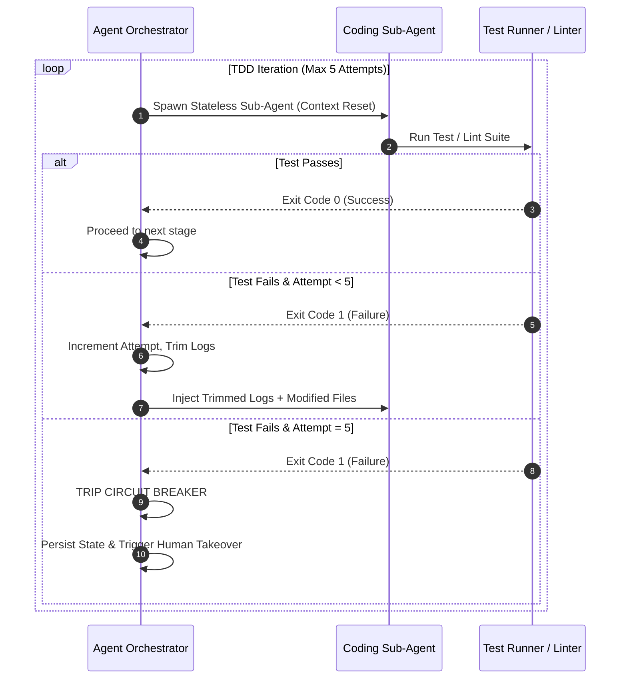

# **Operational Rule: Circuit Breakers & Iteration Limits**

This rule enforces a strict circuit breaker protocol on all iterative agent execution cycles (such as `/tdd-build` and `/e2e-test`). By capping automated fix attempts and resetting intermediate states, we prevent token-burn spirals, Infinite looping errors, and context degradation.

---

## **1. The 5-Attempt Loop Limit**

For any automated coding, compilation, unit testing, lint check, or browser integration task, the orchestrator enforces a hard cap of **5 consecutive execution attempts**.

---

## **2. Detailed Iteration Workflow & Action Protocol**

At each attempt step, the system must adhere to the following sequence:

### **Attempt 1 (Initial Draft)**
*   The agent consumes the active specification contract `SPEC.md` (or archived `docs/specs/issue-X.md`), type definitions, and original code.
*   Writes/modifies the target file.
*   Runs the local test runner. If clean, proceed to ship. If failed, proceed to Attempt 2.

### **Attempts 2 & 3 (Log-Trimmed Adjustments)**
*   **State Cleansing**: The sub-agent context is reset. It does not carry over Attempt 1's intermediate thought process.
*   **Log Trimming**: The orchestrator strips all non-essential output from the compiler/runner and injects only:
    *   The raw error message / assertion failure.
    *   The file path and line number of the failure.
    *   A 10-line source snippet surrounding the failure point.
*   The agent is prompted to resolve the specific error identified.

### **Attempts 4 & 5 (Hypothesis-Driven Repairs)**
*   If error patterns remain identical, the agent is forced to outline its hypothesis before modifying code:
    1.  *What is the suspected root cause?*
    2.  *Which invariant inside the core was violated?*
    3.  *What is the expected correction?*
*   The agent writes its hypothesis to its thought log, then modifies code.

---

## **3. Circuit Breaker Tripping Protocol (Failure at Attempt 5)**

If the test suite or lint checker continues to throw a non-zero exit code after the 5th attempt, the circuit breaker is **tripped**. The following actions are automatically executed:

1.  **Halt Execution Loop**: The autonomous orchestrator suspends all subsequent commands in the `/goal` workflow.
2.  **Generate Diagnostic Report (`circuit_breaker_state.log`)**: The orchestrator writes a structured state snapshot dump to `.agents/circuit_breaker_state.log` detailing:
    *   The target issue being processed.
    *   The exact file(s) modified.
    *   The exact failing tests and linter outputs.
    *   The list of attempts and modifications made.
3.  **Rollback / Secure Workspace**: To prevent corrupting the branch, the orchestrator shelves or stashes the broken changes into emergency branch `drift/circuit-breaker-<timestamp>`, returning the main workspace to a clean, stable state.
4.  **Raise Human Takeover Alert**: A zero-token interrupt is fired by `scripts/hooks/on-circuit-breaker.sh`, printing a clear message and requesting human intervention to resolve the impasse.
