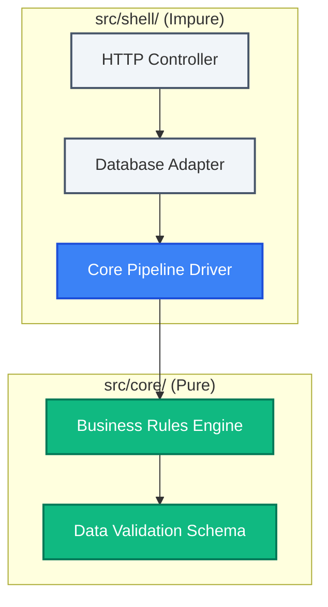

# **Architectural Rule: Functional Core / Imperative Shell (FC/IS) Isolation**

This rule enforces absolute architectural boundaries between pure business logic and impure technical side effects. By isolating business decisions from delivery mechanisms, the codebase remains 100% testable, highly modular, and optimal for autonomous agent development.

---

## **1. Core Separation Definitions**

### **1.1 The Functional Core (`src/core/`)**
The Functional Core contains the engine of the application—all calculations, data transformations, validations, state changes, and business constraints.
*   **Purity**: All code in the Functional Core must be strictly **pure and deterministic**. Given the same inputs, it must return the exact same output.
*   **Allowed Imports & Dependencies**: Only pure packages (such as utilities, mathematical libraries, schema validation libraries like Zod or Pydantic, or language built-ins that have no side-effects) are permitted.
*   **Prohibited Imports & Technical Dependencies**:
    *   No database frameworks (SQL, SQLite, PostgreSQL, Redis, Mongo, ORMs).
    *   No network protocols or libraries (gRPC, HTTP, axios, fetch, socket.io).
    *   No system level file I/O operations (fs, os, paths).
    *   No date-time system clocks (use dependency injection for dynamic timestamps).
    *   No environment variables or secrets loading (dotenv, process.env).
    *   No UI-specific frameworks or logic.

### **1.2 The Imperative Shell (`src/shell/`)**
The Imperative Shell forms the technical boundary around the Functional Core. It acts as the impure driver that translates external stimuli into business decisions.
*   **Responsibilities**:
    *   Handling HTTP endpoints, request routing, and web sockets.
    *   Interacting with physical storage, cache, and files.
    *   Fetching external network services and API calls.
    *   Generating dynamic timestamps and random identifiers.
    *   Decrypting credentials and reading configurations.
    *   Instantiating the Functional Core and piping data through it.
*   **Design Pattern (Pipeline of Side Effects)**:
    1.  **Receive stimuli** (e.g., HTTP request, Queue message, CLI arguments) at the Imperative Shell.
    2.  **Gather external state** (e.g., query database, load secret, read config).
    3.  **Inject data into the Functional Core** via standard function inputs or typed data models.
    4.  **Execute the Core function** synchronously, receiving a deterministic result.
    5.  **Commit side effects** based on the Core's decisions (e.g., execute database writes, dispatch emails, respond with HTTP status).

---

## **2. Import Directionality and Dependency Graphs**

*   **Rule**: **Imports are strictly one-way.** The Imperative Shell can import the Functional Core, but the Functional Core **must never** import the Imperative Shell or any of its external adapter files.



---

## **3. Code Examples & Compliance Guidelines**

### **3.1 Compliant Pattern (Pure Core)**
The Functional Core function accepts all dynamic variables and current db states as arguments, returning a structured decision object with zero external calls:

```typescript
// File: src/core/user_validator.ts
import { UserProfile, ValidationResult } from "./types";

export function validateUserRegistration(
  profile: UserProfile, 
  existingEmails: string[], 
  currentTimestamp: number
): ValidationResult {
  if (existingEmails.includes(profile.email)) {
    return { success: false, reason: "EMAIL_TAKEN", decisionTimestamp: currentTimestamp };
  }
  if (profile.password.length < 8) {
    return { success: false, reason: "PASSWORD_TOO_SHORT", decisionTimestamp: currentTimestamp };
  }
  return { success: true, reason: "VALIDATED", decisionTimestamp: currentTimestamp };
}
```

And the Imperative Shell orchestrates the IO before calling the pure core:

```typescript
// File: src/shell/user_controller.ts
import { db } from "./db_client";
import { validateUserRegistration } from "../core/user_validator";

export async function handleUserRegistration(req: Request, res: Response) {
  const profile = req.body;
  const currentTimestamp = Date.now(); // IO/Side Effect
  
  const existingEmails = await db.query("SELECT email FROM users"); // IO/Side Effect
  
  // Call Pure Core with fully hydrated parameters
  const result = validateUserRegistration(profile, existingEmails, currentTimestamp);
  
  if (!result.success) {
    return res.status(400).json(result);
  }
  
  await db.insert("users", profile); // IO/Side Effect
  return res.status(201).json(result);
}
```

### **3.2 Non-Compliant Pattern (Violating Isolation)**
An agent merges database logic or environment calls directly within the validation system:

```typescript
// NON-COMPLIANT: Direct database connection inside pure folder!
// File: src/core/user_validator.ts
import { db } from "../shell/db_client"; // CRITICAL ERROR: Violates directional import

export async function validateUserRegistration(profile: any) {
  const exists = await db.query("SELECT email FROM users WHERE email = ?", [profile.email]); // CRITICAL ERROR: Side effect inside Core
  if (exists) {
    throw new Error("Email taken");
  }
}
```

---

## **4. Enforcement and Testing Mechanisms**

*   **Linter Checks**: Static import linters (such as dependency cruiser, ESLint `no-restricted-imports`, or import limits in Python) will be run pre-commit to immediately crash the build if `src/core/` tries to import anything outside itself.
*   **Coverage Target**: Code in `src/core/` must maintain `≥ 90%` statement and branch coverage. No core code can be merged if its unit test coverage drops below this threshold.
*   **Mocks Prohibition**: Unit tests under `tests/core/` must not use database containers, HTTP mocking engines (like nock or responses), or stub configurations. All inputs must be mock-free objects and primitives.
