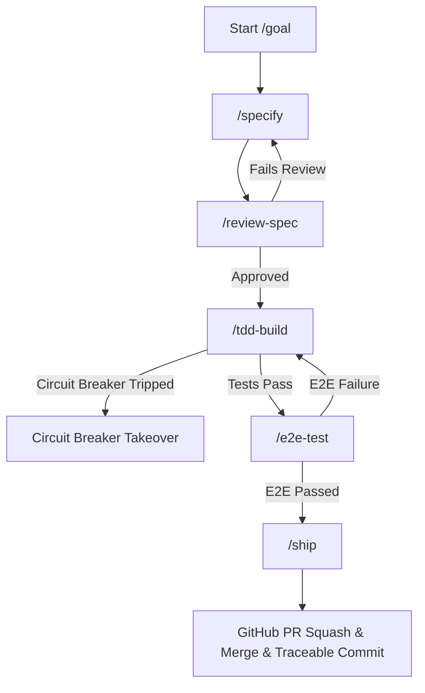

# Workflow: Autonomous Developer Goal Loop (/goal)

## Sequence
The `/goal` command launches the orchestrator background task to execute development sequentially:

> [!IMPORTANT]
> **Strict Sequential Execution Policy**
> The development loop must execute strictly sequentially—one user story (issue specification) at a time—and never in parallel. This guarantees that each completed and squash-merged feature becomes the stable baseline for the next user story, preventing overlapping file edits, branch divergences, and logical conflicts.

## Context Reset Guidelines
At each transition, clear global context, invoking the stateless sub-agent with only current files, the specific spec, and `docs/architecture.md`.

