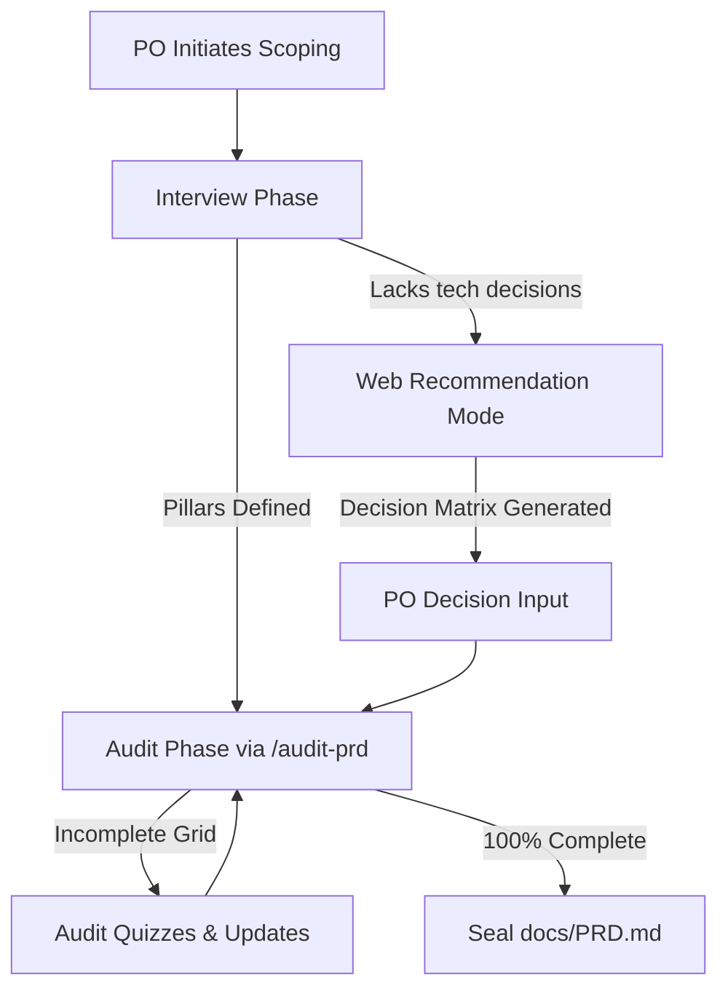

# Workflow: Product Owner Scoping Interview (/interview-prd)

## Sequence

```mermaid
graph TD
    A[PO Initiates Scoping] --> B[Interview Phase]
    B -->|Lacks tech decisions| C[Web Recommendation Mode]
    C -->|Decision Matrix Generated| D[PO Decision Input]
    B -->|Pillars Defined| E[Audit Phase via /audit-prd]
    D --> E
    E -->|Incomplete Grid| F[Audit Quizzes & Updates]
    F --> E
    E -->|100% Complete| G[Seal docs/PRD.md]
```
