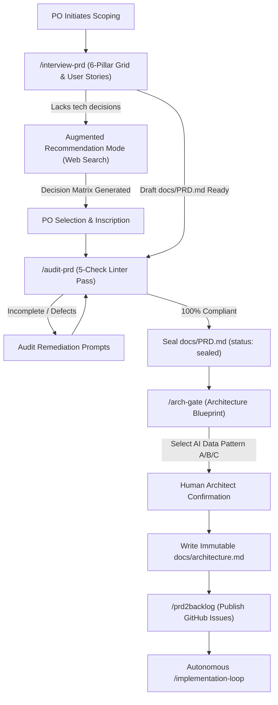

# Workflow: Upstream Scoping & Architecture Gate Pipeline

## Sequence

```mermaid
graph TD
    A[PO Initiates Scoping] --> B["/interview-prd (6-Pillar Grid & User Stories)"]
    B -->|Lacks tech decisions| C["Augmented Recommendation Mode (Web Search)"]
    C -->|Decision Matrix Generated| D[PO Selection & Inscription]
    D --> E["/audit-prd (5-Check Linter Pass)"]
    B -->|Draft docs/PRD.md Ready| E
    E -->|Incomplete / Defects| F[Audit Remediation Prompts]
    F --> E
    E -->|100% Compliant| G["Seal docs/PRD.md (status: sealed)"]
    G --> H["/arch-gate (Architecture Blueprint)"]
    H -->|Select AI Data Pattern A/B/C| I[Human Architect Confirmation]
    I --> J["Write Immutable docs/architecture.md"]
    J --> K["/prd2backlog (Publish GitHub Issues)"]
    K --> L["Autonomous /implementation-loop"]
```
