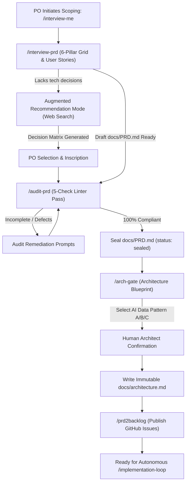

# Skill: Product Scoping & Architecture Pipeline (`/interview-me`)

## 1. Purpose & Strategic Goal
The `/interview-me` skill orchestrates the complete upstream Product Owner scoping pipeline inside **Antigravity CLI (`agy`)**. It sequentially executes:
1. `/interview-prd`: Guided 6-pillar 360° product requirements interview to draft `docs/PRD.md`.
2. `/audit-prd`: Inflexible 5-check linter enforcing 100% PRD completeness before sealing (`status: sealed`).
3. `/arch-gate`: Infrastructure blueprint drafting, AI Data Pattern selection (Pattern A/B/C), and architecture sealing (`docs/architecture.md`).
4. `/prd2backlog`: Backlog story extraction and GitHub issue seeding/reconciliation.

---

## 2. Pipeline Sequence & Governance

---

## 3. Step-by-Step Execution Plan

### Step 1: Product Requirements Interview (`/interview-prd`)
- Invoke `/interview-prd` to interview the Product Owner across all 6 pillars (Functional Vision, Stack & Architecture, Data Strategy, Infra & Deployment, Security & Compliance, Non-Functional & UX).
- Write output to `docs/PRD.md`.

### Step 2: PRD Completeness Audit (`/audit-prd`)
- Invoke `/audit-prd` to run the 5-check linter against `docs/PRD.md`.
- If defects exist, prompt the user for missing details until 100% compliant.
- Seal `docs/PRD.md` with frontmatter `status: sealed`.

### Step 3: Architecture Blueprint Gate (`/arch-gate`)
- Invoke `/arch-gate` to generate system contracts in `docs/architecture.md`.
- Select the optimal AI Data Integration Pattern (Pattern A: Direct Context, Pattern B: Text-to-SQL, Pattern C: RAG).
- Enforce Functional Core (`src/core/`) vs Imperative Shell (`src/shell/`) isolation.

### Step 4: Backlog Generation & GitHub Seed (`/prd2backlog`)
- Invoke `/prd2backlog` to decompose sealed PRD user stories into atomic GitHub Issues via `gh` CLI.
- Link issues to the GitHub Project Board.
- Notify the user that product scoping is 100% complete and ready for `/implementation-loop`.
